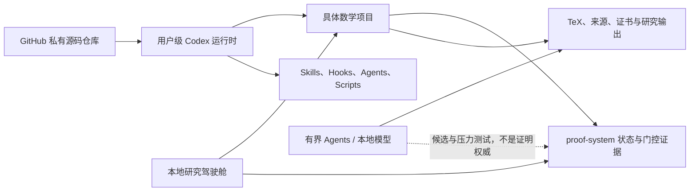

# Codex Math Research Workbench

一个面向长期数学研究的私有、门控式 Codex 工作台。它把数学项目状态治理、来源一致性、公式级证明证书、对抗审查、TeX 机械验证、结果收获、上下文续接、本地可视化，以及合格受管项目的本地 Codex Git worktree 准备，集中到可审计、可恢复的工作流中。

> [!IMPORTANT]
> 本系统管理研究过程与证据，不是自动证明器。绿色 dashboard、Git 提交、TeX 编译、有限计算、agent 共识、Qwen 或其他模型输出都不能单独证明定理，也不能关闭 `public-claim-ready`。

本仓库是本机 Codex 数学研究运行时的可维护源码仓库，同时明确排除真实项目内容、会话上下文、凭据、数据库、日志、缓存、快照和大型运行输出。仓库目前为私有用途，未授予公开再分发许可证。

## 为什么需要它

长期数学工作最容易在以下位置失真：命题在迭代中悄然变强、引用范围漂移、局部证书被误写成全局证明、失败路线被重复探索、旧报告被当作当前证据，以及长任务在上下文切换后无法可靠恢复。

本系统把这些风险变成显式接口：

- 用精确 Claim Card 固定命题、假设、结论、常数、端点和来源范围。
- 用 proof gates 分离来源、证明、对抗、双语、机械和公开宣称状态。
- 用事务化项目状态记录 Claim 谱系、不可变迭代和受保护投影。
- 用 obstruction ledger 保留失败路线、反例和不可复用桥段。
- 用 formula-level certificate 替代“显然”“由稠密性”“传递到极限”等证明移动短语。
- 用同步 Outcome Harvest Pipeline 识别可独立复用的结果、边界、工具和应用线索。
- 用可恢复的 context cycle 在长任务间传递耐久证据，而不是依赖聊天摘要。

## 系统架构



三层边界如下：

| 层级 | 主要内容 | 不应包含 |
| --- | --- | --- |
| 本仓库 | 可移植 skills、agents、hooks、scripts、改进协议、驾驶舱源码 | 凭据、会话数据库、真实项目运行上下文 |
| 用户级运行时 | 安装后的固定入口、路由钩子、技能与本机配置 | 应提交到数学项目的 Claim 或证明证据 |
| 数学项目 | `proof-system/`、TeX、来源、证书、障碍、项目脚本与结果 | 用户级凭据、无关缓存和其他项目数据 |

## 核心能力

| 能力 | 作用 | 证据边界 |
| --- | --- | --- |
| Math Research System | 分类任务、初始化精确 Claim、生成 dashboard、管理项目状态，并为合格项目准备本地 Codex Git worktree | 系统一致不等于数学正确；worktree 准备不配置远端、不推送 |
| Transactional State | 记录 Claim 谱系、不可变迭代、受保护状态更新和显式恢复 | 事务成功只证明状态更新完整 |
| Proof Gate Orchestration | 管理来源、证明、对抗、双语、机械和公开宣称门 | 不从模板、旧报告或模型投票关门 |
| Source Fidelity | 比较本地命题与原始文献或原题面 | 必须检查原始来源、范围、常数和端点 |
| Formula Certificates | 固化映射、公式、估计、常数、误差和极限步骤 | 不能用概括性短语替代证明桥 |
| Adversarial Workflow | 搜索反例、隐藏假设、退化端点和过强结论 | agent 输出必须由主流程复核 |
| Bilingual TeX Sync | 英文主稿稳定后同步中文声明、常数、标签和依赖 | 双语一致不证明定理为真 |
| Mechanical Verification | 隔离构建、标签/引用/日志/危险短语检查 | 构建通过只说明机械健康 |
| Open-Problem Ledger | 区分开放、条件、局部证书、失败和反例 | 局部闭合不能升级为全局定理 |
| Outcome Harvest | 对耐久节点形成哈希链观察并发现独立价值 | `proof_authority=false`，Card 接纳仍由人决定 |
| Context Cycles | 在安全阶段边界建立可恢复交接和唯一后继 | 当前默认 shadow；续接不是证明证据 |
| Research Cockpit | 浏览状态树、diff、证据、风险和运行事件 | 绿色界面没有证明权威 |

## 仓库结构

- `backend/skills/`：数学研究系统、proof gate、source fidelity、双语同步、开放问题、对抗工作流、系统改进与工具审计。
- `backend/agents/`：文献侦察、证明对抗、反例搜索、保守审计、TeX 验证和状态摘要等有界角色契约。
- `backend/hooks/`：数学路由、项目标题、上下文周期和停止阶段治理钩子。
- `backend/scripts/`：稳定 PowerShell/Python 入口与兼容包装器。
- `backend/math-system-improvement/`：方法控制器、变更提案、事务策略、上下文周期、Outcome Harvest、工具生命周期和改进台账。
- `visualizer/`：本地研究驾驶舱、运行记录、事件流、状态树、diff 和回归测试。
- `scripts/`：仓库启动、安装与完整验证入口。
- `math-research-system-workflow.md`：从探索到 review-grade closure 的完整专业流程。
- `SECURITY.md`：本地运行、隐私、凭据和公开前审计要求。

## 快速开始

### 1. 验证仓库

```powershell
powershell -NoProfile -ExecutionPolicy Bypass -File .\scripts\verify.ps1
git diff --check
```

验证覆盖 Python 语法、数学研究系统自测、路由 hook、自恢复数据包检查、驾驶舱回归测试，以及 Node 可用时的前端 JavaScript 语法。验证通过表示源码和工作流机械一致，不表示任何数学命题已证明。

### 2. 启动本地驾驶舱

```powershell
powershell -NoProfile -ExecutionPolicy Bypass -File .\scripts\start-workbench.ps1 -Port 8765
```

打开 `http://127.0.0.1:8765/`。服务没有鉴权，因此只允许绑定 `127.0.0.1` 或 `localhost`。Codex 写入开关默认关闭；只有在界面中显式开启后，才会在所选项目内启动可写任务。

运行记录默认写入被 Git 忽略的 `visualizer/work/`。也可设置 `MATH_WORKBENCH_DATA_DIR` 将数据放到仓库外。

### 3. 审计一个数学项目

```powershell
powershell -NoProfile -ExecutionPolicy Bypass -File .\backend\scripts\math-system-health.ps1 `
  -Command dashboard -Project <PROJECT_PATH> -StaleDays 30 -NoAutoGit
```

结果含义：

- `red`：状态、事务、隐私或机械结构存在阻断问题。
- `yellow`：仍有开放 gate，不能公开宣称。
- `green`：系统结构一致；仍需底层来源、证明、对抗和机械证据。
- `stale-state-file`：关键状态过旧，恢复研究前必须刷新。

本工作台仓库自身不是一个绑定了精确 Claim 的数学项目，因此根目录没有 `proof-system/` 是正常的。不要为了让 dashboard 变绿而初始化虚假 Claim。

对于具有有效精确 Claim 与合格 `proof-system/` 的数学项目，成功 `init` 或明确 `state-migrate` 后会准备本地 Codex Git worktree 的前提条件；它不创建 chat-owned worktree、不配置远端，也不推送。可只读检查：

```powershell
powershell -NoProfile -ExecutionPolicy Bypass -File .\backend\scripts\math-system-health.ps1 `
  -Command worktree-ready -Project <PROJECT_PATH> -ReadOnly -Json
```

### 4. 安装到用户级 Codex 运行时

先预览：

```powershell
powershell -NoProfile -ExecutionPolicy Bypass -File .\scripts\install-backend.ps1 -WhatIf
```

确认后去掉 `-WhatIf`。脚本只覆盖仓库管理的组件，并将被替换版本备份到 `CODEX_HOME/backups/math-research-workbench/`。版本库中的二阶改进 bundle 默认不部署，只有显式添加 `-IncludeImprovementState` 才会复制整个 `backend/math-system-improvement/`；脚本不会删除运行时额外文件。

入口优先使用 `CODEX_PYTHON`，否则发现 Codex bundled Python 或 `python`。可用 `CODEX_HOME`、`MATH_SYSTEM_HEALTH` 和 `CODEX_EXE` 覆盖默认发现。

## 项目状态与事务

有精确 Claim 后，受管项目使用 `proof-system/` 作为固定接口：

- `PROJECT_STATE.json`：生命周期、active Claim、已提交 iteration head 和投影哈希。
- `CLAIM_REGISTRY.json`：Claim 身份、父子关系和显式范围变更。
- `iterations/`：不可变事务记录链。
- `ACTIVE_STATE.md`：当前路线、可信状态和下一步。
- `CLAIM_CARD.md`：精确命题、假设、结论、常数、端点、来源和脆弱桥段。
- `OBSTRUCTION_LEDGER.md`：失败路线、反例和可复用障碍。
- `SOURCE_FIDELITY.md`：原始来源或题面与本地 Claim 的对照。
- `PROOF_GATE.json`：机器可读 gate 状态与证据绑定。
- `PUBLIC_CLAIM_READY.md`：默认 non-ready 的公开宣称镜像。
- `EVIDENCE_LEDGER.jsonl`：命令、工件和状态连续性记录；不是数学证明。

重要状态更新通过 `state-migrate`、`claim-transition`、`iteration-commit`、`canonical-record-update`、`closure-bind`、validator-backed `gate-update` 和显式 `transaction-recover` 完成。审计命令不会自动恢复中断事务，也不会从旧 Claim 继承 gate closure。

查看当前包装器支持的完整命令：

```powershell
powershell -NoProfile -ExecutionPolicy Bypass -File .\backend\scripts\math-system-health.ps1 -Command help
```

常用命令分为：只读/审计入口 `classify`、`audit`、`dashboard`、`project-status`；事务入口 `init`、`state-migrate`、`claim-transition`、`iteration-commit`、`canonical-record-update`、`closure-bind`、`transaction-recover`；Git worktree 与维护入口 `worktree-ready`、`gate-update`、`snapshot`、`restore`、`doctor`、`selftest`、`harvest-checkpoint`。具体可用参数以 `-Command help` 和技能契约为准。

## Proof Gate 与结论分类

一个结果应明确分类，而不是笼统写成“已证明”：

- `open`：关键义务仍开放。
- `conditional`：依赖未证明假设或缺失输入。
- `counterexample`：当前表述被具体反例或障碍否定。
- `proved-local`：存在本地公式级证书，但其他 gate 未全部闭合。
- `source-faithful`：当前范围与原始来源匹配。
- `mechanically-verified`：确定性机械检查通过。
- `public-claim-ready`：精确 Claim 的全部必需 gate、当前 TeX、原始来源和冻结证据闭合。

review-grade closure 至少要求：当前 TeX、原始来源、冻结 Claim Card、公式级证书、对抗检查、适用时的双语同步、确定性机械报告，以及与当前字节绑定的 closure bundle。

## Outcome Harvest

Outcome Harvest Pipeline 与探索同步运行，而不是项目结束后的整理步骤。事务化 `iteration-commit` 发布不可变迭代后会自动触发 checkpoint；事务外的耐久工件通过稳定 `harvest-checkpoint` 路由记录。

系统为耐久节点建立哈希链观察，可保留精确局部结果、障碍、反例、新工具、不变量、归约、应用映射和阶段闭合。自动 checkpoint 不能创建候选论文结论或关闭 proof gate；独立 Result Opportunity Card 的接纳、来源、优先权、独立价值和发表判断仍由人审查。

详见 `backend/math-system-improvement/RESULT_HARVEST_README.md` 与 `APPLICATION_AND_SOURCE_MAP_PROTOCOL.md`。

## Context Cycles

长任务在安全阶段边界把精确 Claim、当前路线、常数端点、证书路径与哈希、开放义务、失败路线、来源漂移和 gate 状态写入耐久项目文件。新任务必须重新读取并验证这些文件；handoff prose 只用于导航。

当前自动策略为 `shadow`：自最近原生 compaction 起达到 100 次模型调用或 160,000 raw latest-call input 时只记录压力，不自动创建后继、改标题或归档任务。候选 hard policy 为 200 次调用或 300,000 raw input，并且只有在原生 compaction 后压力仍持续、校准门通过且显式切换模式后才可启用。上下文周期不会降低推理强度、跳过证明义务或改变 proof gate。

详见 `backend/math-system-improvement/CONTEXT_CYCLE_POLICY.md`。

## Agents 与本地模型

有界 agents 适合独立的来源查找、反例搜索、对抗审查、TeX 验证和状态维护。主流程保留关键路径，并必须复核 agent 输出。多代理一致、模型置信度和本地 Qwen 输出都不是证明权威。

角色契约见 `backend/agents/README.md`。数学工作流会根据任务宽度采用 0–4 个有界 sidecar，并避免重复、写冲突或无法整合的并行工作。

## 隐私与安全

- 驾驶舱仅绑定本机回环地址，不提供网络鉴权。
- 不提交 `.env`、`auth.json`、`cap_sid`、token、私钥、浏览器状态、Codex 会话数据库或目标项目运行上下文。
- `visualizer/work/`、日志、缓存、数据库、HOLDOUTS、VALIDATION_REPORTS、备份和自动化状态不进入受管源码同步。
- 部署和私有 GitHub 同步必须进行路径、大小、凭据、可移植性、依赖闭包、分支、远端隐私和非强制推送检查。
- 每日私有同步是用户级外部 automation，不是仓库内置调度服务；本仓库只记录其应遵守的源码、隐私和验证边界。
- 不自动解决冲突，不改写历史，不改变仓库可见性，不删除用户文件来追随运行时缺失项。
- 公开仓库前必须重新执行凭据、隐私、第三方来源、NOTICE 和许可证审计。

完整政策见 `SECURITY.md`。

## 文档导航

- [完整数学研究流程](math-research-system-workflow.md)
- [组件、命令与数据边界地图](docs/COMPONENTS.md)
- [安全政策](SECURITY.md)
- [研究驾驶舱说明](visualizer/outputs/diff-llm-visualizer/README.md)
- [Agent 角色与证据边界](backend/agents/README.md)
- [Math Research System 技能契约](backend/skills/math-research-system/SKILL.md)
- [Proof Gate Orchestrator](backend/skills/proof-gate-orchestrator/SKILL.md)
- [Source-Faithful Proof Audit](backend/skills/source-faithful-proof-audit/SKILL.md)
- [Bilingual TeX Sync](backend/skills/bilingual-tex-sync/SKILL.md)
- [Context Cycle Policy](backend/math-system-improvement/CONTEXT_CYCLE_POLICY.md)
- [Outcome Harvest Pipeline](backend/math-system-improvement/RESULT_HARVEST_README.md)
- [Application and Source-Map Protocol](backend/math-system-improvement/APPLICATION_AND_SOURCE_MAP_PROTOCOL.md)
- [Improvement Backlog](backend/math-system-improvement/IMPROVEMENT_BACKLOG.md)
- [Tool Lifecycle Registry](backend/math-system-improvement/TOOL_LIFECYCLE_REGISTRY.json)

## 当前边界

本仓库提供本地研究基础设施，不声称解决任何具体开放问题，也不把自身测试结果解释为数学定理证明。具体项目只有在精确 active Claim、当前来源、公式级证书、对抗审查、机械验证和全部必需 gate 对齐后，才可能进入公开宣称审查。

# Mathematical Research System

一个面向长期数学研究的、以证据与审计为中心的工作流系统。

A research workflow system for long-running mathematical work, designed around explicit evidence, reviewable state, and clear boundaries between research process and mathematical proof.

## Purpose

Long mathematical projects can lose rigor when claims silently change, source scope drifts, local checks are described as global results, failed routes are forgotten, or task context is carried only in informal summaries.

This project organizes those risks into an explicit research workflow. It is designed to help maintain a reliable record of what is known, conditional, blocked, mechanically checked, or ready for further review.

## Core Workflow

- **Claim cards** record the exact statement, hypotheses, conclusion, constants, endpoints, source scope, and fragile proof steps.
- **Source-fidelity review** compares a local claim with its original source before the claim is reused or strengthened.
- **Proof gates** distinguish open questions, conditional conclusions, local certificates, source-faithful statements, mechanical checks, and public-claim-ready results.
- **Formula-first certificates** require explicit maps, estimates, constants, errors, and limiting steps at proof-critical transitions.
- **Adversarial review** searches for counterexamples, hidden assumptions, endpoint failures, and conclusions stronger than the available evidence.
- **Obstruction ledgers** preserve failed routes and reusable negative results.
- **Reproducible state records** support recovery across long research cycles.

## Evidence Boundary

This system manages research process and evidence. It is **not** an automated theorem prover.

A successful build, a passing automated check, a version-control record, a finite computation, or AI-generated analysis is useful engineering evidence, but none is mathematical proof authority by itself. Substantive claims require explicit certificates, source verification, and appropriate human review.

## Result Classification

Research outcomes are recorded with explicit status rather than a generic "proved" label:

| Status | Meaning |
| --- | --- |
| `open` | Essential obligations remain unresolved. |
| `conditional` | The conclusion relies on an unproved assumption or missing input. |
| `counterexample` | The current formulation is refuted or obstructed. |
| `proved-local` | A local certificate exists, while other review gates remain open. |
| `source-faithful` | The stated scope has been checked against the original source. |
| `mechanically-verified` | Deterministic mechanical checks have passed. |
| `public-claim-ready` | Required source, proof, review, and mechanical evidence has been aligned for the exact claim. |

## Availability

This public repository describes the research methodology and system design.

The implementation, active research materials, unpublished proofs, internal automation, and project-specific evidence remain under controlled access. They are not included here to protect intellectual property, active research integrity, and private project context.

## Scope

The system does not claim to solve a specific open problem. Its role is to provide disciplined infrastructure for mathematical research, where process consistency must never be confused with proof correctness.
